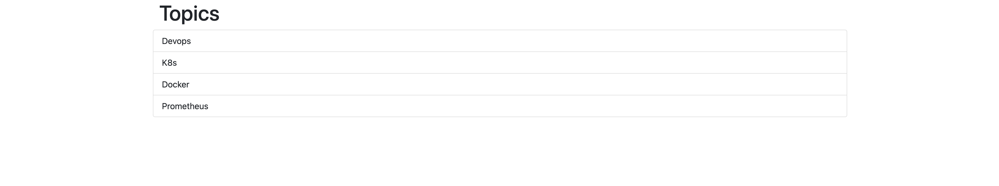

### Solución ejercicio 2

Creamos el archivo docker-compose.yml:

```yml
services:
  mongodb:
    image: mongo
    ports:
      - "27017:27017"
    networks:
      - lemoncode-challenge
    volumes:
      - mongo-data:/data/db

  backend:
    build: ./backend
    ports:
      - "3000:5000"
    networks:
      - lemoncode-challenge
    depends_on:
      - mongodb
    environment:
      DATABASE_URL: ${DATABASE_URL}
      DATABASE_NAME: ${DATABASE_NAME}
      HOST: ${HOST}

  frontend:
    build: ./frontend
    ports:
      - "8080:3000"
    networks:
      - lemoncode-challenge
    depends_on:
      - backend
    environment:
      API_URI: ${API_URI}

networks:
  lemoncode-challenge:

volumes:
  mongo-data:
```

Archivo .env:

```ini
DATABASE_URL=mongodb://mongodb:27017
DATABASE_NAME=TopicstoreDb
HOST=0.0.0.0
API_URI=http://backend:5000/api/topics
```

Ejecutamos el siguiente comando:

```sh
docker compose up -d
```

Comprobamos que todo funciona correctamente:

[http://localhost:8080](http://localhost:8080)


